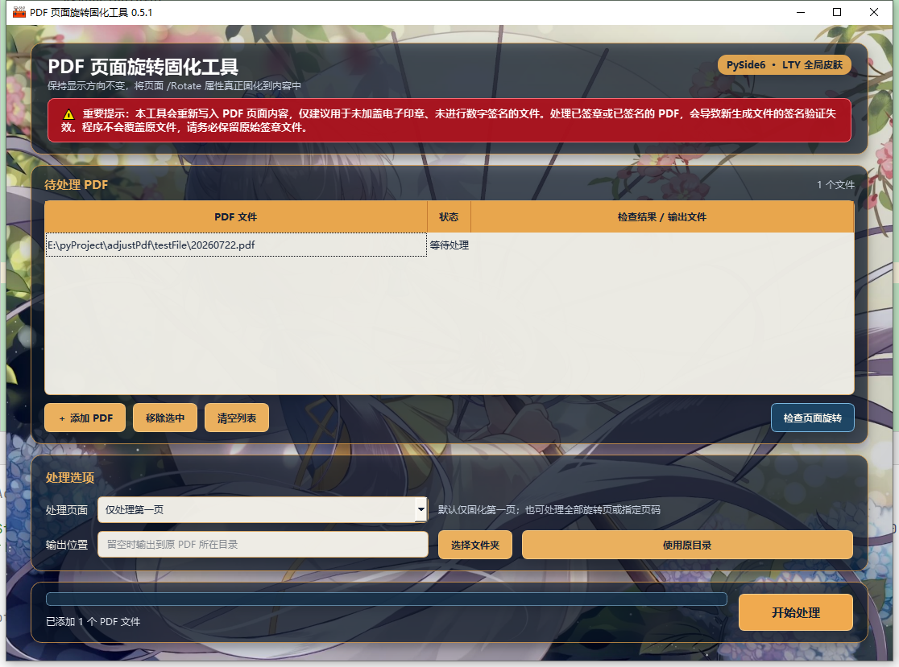

# LTY 界面皮肤完整说明

本文说明 PDF 页面旋转固化工具的 LTY 背景皮肤、PySide6 界面结构、资源生成方式和后续扩展边界。皮肤只属于图形界面，不参与 PDF 读取、旋转固化、签名检测或文件写出。

## 1. 当前皮肤资源

当前源图为：

```text
assets/lty.jpg
尺寸：2560 × 1440
比例：16:9
```

资源脚本会生成：

```text
resources/skins/lty.png
```

源码运行和 PyInstaller EXE 都通过 `resource_path()` 加载同一 PNG。

## 2. 为什么从 Tkinter 改为 PySide6

早期 Tkinter 版本只能使用不透明 Frame 承载表格和按钮。大面板会遮住绝大部分背景，只能从窗口边缘看到少量壁纸，而且很难稳定实现半透明卡片。

0.5.1 将 GUI 重构为 PySide6，主要目的是：

- 使用 Qt 样式表的 RGBA 颜色实现真实半透明卡片；
- 使用自绘背景控件按比例铺满整个窗口；
- 让背景从卡片内部、卡片间隔和窗口四周持续可见；
- 保持表格、输入框和文字的对比度；
- 为后续多皮肤、预览区和界面动画保留扩展空间。

PDF 处理服务、pypdf 引擎和 CLI 没有因此改变。

## 3. 全局背景怎样渲染

`BackgroundWidget` 在 `paintEvent()` 中完成背景绘制：

1. 加载 `resources/skins/lty.png`；
2. 使用 `KeepAspectRatioByExpanding` 等比例缩放；
3. 将缩放后的图片居中裁剪到窗口尺寸；
4. 叠加很轻的深色渐变，保证浅色区域上的文字可读；
5. 背景资源缺失时回退为深蓝色纯色背景。

背景不会被拉伸变形。窗口比例与原图不一致时，可能裁掉上下或左右的一小部分。

## 4. 四张悬浮卡片

主窗口在全局背景上布置四张相互独立的半透明卡片：

1. 标题和红色风险提示；
2. PDF 文件列表和文件操作；
3. 页面范围与输出目录；
4. 进度、状态和开始处理按钮。

卡片使用半透明深蓝背景、暖金边框和阴影。卡片四周以及卡片之间保留固定间距，所以原图不再只从最外侧边缘露出；同时卡片自身也会透出背景色彩。

## 5. 红色重要提示

常驻风险提示使用深红色背景、亮红边框、白色加粗文字和警告符号：

> 本工具会重写 PDF 内容。修正已签署 PDF 会导致新文件的数字签名或电子印章验证失效。

红色提示只是第一层提醒。点击“开始处理”后，程序仍会执行标准 PDF 数字签名预检；发现签名后会显示二次确认对话框，默认取消处理。

## 6. 自适应与可读性

默认窗口尺寸为 `1100 × 790`，最小尺寸为 `900 × 700`。窗口缩放时：

- 背景始终等比例铺满并居中；
- 文件列表获得主要伸缩空间；
- 四张卡片保持间距；
- 风险提示自动换行；
- 指定页码控件只在选择“按页码处理”时显示；
- 输入框和表格使用接近不透明的浅色底，避免文件路径难以辨认。

## 7. 皮肤与 PDF 功能隔离

皮肤不会修改：

- 页面旋转检查；
- 仅第一页、所有旋转页、指定页码三种范围；
- `transfer_rotation_to_content()`；
- 数字签名预检；
- 输出文件命名；
- 临时文件验证和安全替换；
- CLI 命令行模式。

## 8. 重新生成皮肤资源

替换 `assets/lty.jpg` 后运行：

```powershell
powershell -ExecutionPolicy Bypass -File .\scripts\create_skin_assets.ps1
```

随后重新构建 EXE：

```powershell
powershell -ExecutionPolicy Bypass -File .\scripts\build.ps1
```

旧 EXE 内嵌的背景不会自动更新。

## 9. PyInstaller 打包

构建脚本使用 `--add-data` 携带背景和图标。PyInstaller 会自动收集当前代码实际使用的 PySide6 Qt 模块。单文件 EXE 启动时，`resource_path()` 会兼容 PyInstaller 临时解压目录。

## 10. 截图验收

开发阶段使用 Qt 的离屏平台实际创建窗口，并通过 `QWidget.grab()` 生成截图。验收至少检查：

- 背景资源成功加载；
- 原图色彩在窗口四周和卡片间隔明显可见；
- 半透明卡片内仍能感知背景；
- 红色风险提示清晰；
- 默认模式为“仅处理第一页”；
- 指定页码输入框默认隐藏；
- 所有控件没有重叠或被裁切。

### 10.1 本次实际验收结果

正式构建的 `dist/PDF旋转固化工具.exe` 已于 2026 年 7 月 24 日实际启动并自动截取主窗口：



验收数据：

- EXE 窗口标题：`PDF 页面旋转固化工具 0.5.1`；
- 截图尺寸（含 Windows 窗口边框）：`1116 × 829`；
- LTY 背景资源加载成功；
- 左、右、顶部留白与原背景亮度相关系数分别为 `0.999`、`0.988`、`0.994`；
- 两条主要卡片间隔与原背景相关系数为 `0.963`、`0.949`；
- 红色警示区域采样像素为 `RGB(167, 21, 32)`；
- 四张卡片均在窗口范围内，没有重叠或裁切；
- 默认模式仍为“仅处理第一页”，指定页码输入框默认隐藏。

以上结果说明背景并非只在边缘显示：窗口四周、功能区间隔以及半透明卡片内部都保留了原图视觉信息。

## 11. 后续扩展

PySide6 版本可以继续扩展：

- 多套内置皮肤与皮肤选择器；
- 记住上次选择；
- 不同比例的背景裁剪锚点；
- PDF 页面缩略图或处理前预览；
- 将颜色、透明度、圆角和间距拆成主题配置。

皮肤层不得直接调用 PDF 引擎，业务操作继续统一通过 `PdfProcessingService`。

## 12. 相关文件

```text
assets/lty.jpg
resources/skins/lty.png
scripts/create_skin_assets.ps1
src/adjust_pdf/gui/main_window.py
src/adjust_pdf/resources.py
docs/SKIN.md
```
